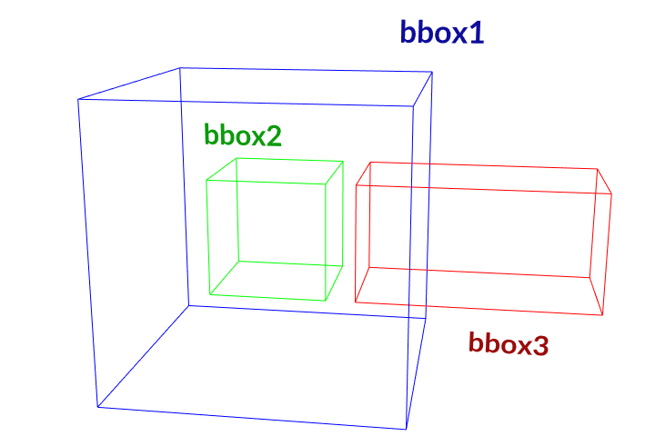
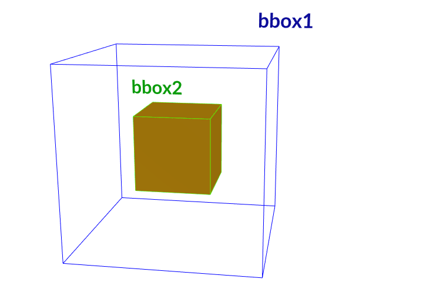
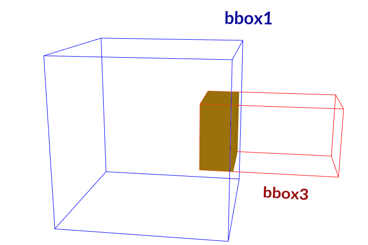

.. currentmodule:: houdini_core_tools.bounding

==================
Bounding Box Tools
==================

The :mod:`~houdini_core_tools.bounding` module provides tools related to operating on :class:`hou.BoundingBox` objects.

add_to_bounding_box_max
-----------------------

The :func:`add_to_bounding_box_max` function will add the supplied :class:`hou.Vector3` value to the
:meth:`hou.BoundingBox.maxvec` values.

.. code-block:: python

    >>> bbox = hou.BoundingBox(-0.5, -0.5, -0.5, 0.5, 0.5, 0.5)
    >>> bounding.add_to_bounding_box_max(bbox, hou.Vector3(0.5, 0.5, 0.5))
    >>> bbox
    <hou.BoundingBox [-0.5, 1, -0.5, 1, -0.5, 1]>

add_to_bounding_box_min
-----------------------

The :func:`add_to_bounding_box_min` function will add the supplied :class:`hou.Vector3` value to the
:meth:`hou.BoundingBox.minvec` values.

.. code-block:: python

    >>> bbox = hou.BoundingBox(-0.5, -0.5, -0.5, 0.5, 0.5, 0.5)
    >>> bounding.add_to_bounding_box_min(bbox, hou.Vector3(0.5, 0.5, 0.5))
    >>> bbox
    <hou.BoundingBox [0, 0.5, 0, 0.5, 0, 0.5]>
    >>> bounding.add_to_bounding_box_min(bbox, hou.Vector3(-1, -1, -1))
    >>> bbox
    <hou.BoundingBox [-1, 0.5, -1, 0.5, -1, 0.5]>

bounding_box_area
-----------------

The :func:`bounding_box_area` function returns the area of the :class:`hou.BoundingBox` surface.

.. code-block:: python

    >>> bbox = hou.BoundingBox(-0.5, -0.5, -0.5, 0.5, 0.5, 0.5)
    >>> bounding.bounding_box_area(bbox)
    6.0

bounding_box_is_inside
----------------------

The :func:`bounding_box_is_inside` function will checks whether a :class:`hou.BoundingBox` is completely enclosed by
another :class:`hou.BoundingBox`.

.. code-block:: python

    >>> bbox1 = hou.BoundingBox(-0.5, -0.5, -0.5, 0.5, 0.5, 0.5)
    >>> bbox2 = hou.BoundingBox(-0.2, -0.2, -0.2, 0.2, 0.2, 0.2)
    >>> bbox3 = hou.BoundingBox(0.3, -0.2, -0.2, 1.1, 0.2, 0.2)
    # A box cannot completely enclose itself.
    >>> bounding.bounding_box_is_inside(bbox1, bbox1)
    False
    >>> bounding.bounding_box_is_inside(bbox2, bbox1)
    True
    # Reversed the parameter order
    >>> bounding.bounding_box_is_inside(bbox1, bbox2)
    False
    >>> bounding.bounding_box_is_inside(bbox3, bbox1)
    False

bounding_box_volume
-------------------

The :func:`bounding_box_volume` function returns the volume of the :class:`hou.BoundingBox` surface.

.. code-block:: python

    >>> bbox = hou.BoundingBox(-0.5, -0.5, -0.5, 0.5, 0.5, 0.5)
    >>> bounding.bounding_box_volume(bbox)
    1.0

bounding_boxes_intersect
------------------------

The :func:`bounding_boxes_intersect` function will checks whether a :class:`hou.BoundingBox` is intersects another
:class:`hou.BoundingBox`.

.. code-block:: python

    >>> bbox1 = hou.BoundingBox(-0.5, -0.5, -0.5, 0.5, 0.5, 0.5)
    >>> bbox2 = hou.BoundingBox(-0.2, -0.2, -0.2, 0.2, 0.2, 0.2)
    >>> bbox3 = hou.BoundingBox(0.3, -0.2, -0.2, 1.1, 0.2, 0.2)
    >>> bounding.bounding_boxes_intersect(bbox1, bbox2)
    True
    >>> bounding.bounding_boxes_intersect(bbox1, bbox3)
    True
    >>> bounding.bounding_boxes_intersect(bbox2, bbox3)
    False

compute_bounding_box_intersection
---------------------------------

The :func:`compute_bounding_box_intersection` function will compute the intersection of two :class:`hou.BoundingBox`
objects.

.. code-block:: python

    >>> bbox1 = hou.BoundingBox(-0.5, -0.5, -0.5, 0.5, 0.5, 0.5)
    >>> bbox2 = hou.BoundingBox(-0.2, -0.2, -0.2, 0.2, 0.2, 0.2)
    >>> bbox3 = hou.BoundingBox(0.3, -0.2, -0.2, 1.1, 0.2, 0.2)
    # Boxes 2 and 3 do not intersect, so the result is None.
    >>> bounding.compute_bounding_box_intersection(bbox2, bbox3) == None
    True
    # Box 2 is completely enclosed by Box 1, so the intersection box is Box 2.
    >>> bounding.compute_bounding_box_intersection(bbox1, bbox2)
    <hou.BoundingBox [-0.2, 0.2, -0.2, 0.2, -0.2, 0.2]>
    >>> bounding.compute_bounding_box_intersection(bbox1, bbox2) == bbox2
    True

.. code-block:: python

    >>> bbox1 = hou.BoundingBox(-0.5, -0.5, -0.5, 0.5, 0.5, 0.5)
    >>> bbox3 = hou.BoundingBox(0.3, -0.2, -0.2, 1.1, 0.2, 0.2)
    >>> bounding.compute_bounding_box_intersection(bbox1, bbox3)
    <hou.BoundingBox [0.3, 0.5, -0.2, 0.2, -0.2, 0.2]>

expand_bounding_box
-------------------

The :func:`expand_bounding_box` function the min and max bounds in each direction by the axis delta.
