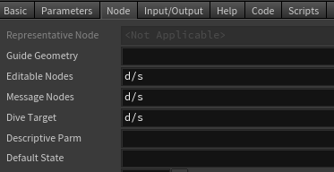

.. currentmodule:: houdini_core_tools.hdas

===========================
Houdini Digital Asset Tools
===========================

The :mod:`~houdini_core_tools.hdas` module provides tools related to dealing with Houdini digital assets.

get_node_descriptive_parameter
------------------------------

The :func:`get_node_descriptive_parameter` function will return the user name of the node's creator.

get_node_dive_target
--------------------

The :func:`get_node_dive_target` function will return the user name of the node's creator.

