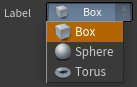
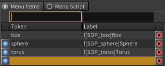
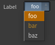
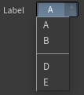
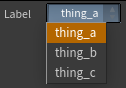
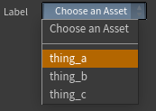

.. currentmodule:: houdini_core_tools.menus

=============================
Parameter Menu Building Tools
=============================

The :mod:`~houdini_core_tools.menus` module provides convenient tools to help with building Houdini parameter menus.

format_label_for_icon
---------------------
A largely unadvertised fact is that Houdini allows you to add icons to menu item labels:

To do this you need to prefix your label value with ``![{icon}]``.

The :func:`format_label_for_icon` function provides this convenient functionality
so you don't need to remember the format yourself.

.. code-block:: python

    >>> format_label_for_icon("A Box", "SOP_box")
    '![SOP_box]A Box'

format_orange_label_text
------------------------
Houdini allows you to color a menu label orange by prefixing the label value with the unicode character for `2`.

The :func:`format_orange_label_text` function provides this convenient functionality
so you don't need to remember the format yourself.

.. code-block:: python

    >>> chr(2) + "bar"
    '\x02bar'
    >>> format_orange_label_text("bar")
    '\x02bar'

get_menu_separator_entry
------------------------
The :func:`get_menu_separator_entry` function is a convenience function which returns
a tuple containing values that you can use to insert a separator into a menu when building it manually via Python.

.. code-block:: python

    >>> get_menu_separator_entry()
    ('__separator__', '')

Using the following code in a menu script results in a nicely separated series of items.

.. code-block:: python

    menu = ['a', 'A', 'b', 'B']
    menu.extend(get_menu_separator_entry())
    menu.extend(['d', 'D', 'e', 'E'])
    return menu

make_houdini_menu
-----------------

The :func:`make_houdini_menu` function decorator is a convenience tool to make generating
menus from lists of items easier. You can use it to decorate a function that returns a list of strings and it will
automatically convert that list into a Houdini menu style list (by duplicating the items for keys/values) so you
don't have to worry about it.

It can also take some additional arguments which allow you to define any items you wish to be inserted before the
returned items, and to add a separator in between.

Consider this example of building a menu entry for a list of assets from your pipeline.

.. code-block:: python

    >>> @make_houdini_menu()
    ... def get_assets(): return ["thing_a", "thing_b", "thing_c"]
    ...
    >>> get_assets()
    ('thing_a', 'thing_a', 'thing_b', 'thing_b', 'thing_c', 'thing_c')

In this contrived example we simply get the assets from some place and allow the decorator to convert them to a list
that Houdini can use to generate the actual menu.

However, if we want to choose an asset for something, a better thing would be to have the menu originally prompt you to
choose rather than relying on the default/first entry.

.. code-block:: python

    >>> @make_houdini_menu(pre_items=[("choose", "Choose an Asset")], add_separator=True)
    ... def get_assets(): return ["thing_a", "thing_b", "thing_c"]
    ...
    >>> get_assets()
    ('choose', 'Choose an Asset', '__separator__', '', 'thing_a', 'thing_a', 'thing_b', 'thing_b', 'thing_c', 'thing_c')

Here we manually provide any items (as a sequence of key/value tuples) we want inserted before our wrapped values and
indicate that we want to add a separator in between. This allows our parameter to easily define a default value of ``choose``
and any validation to check the value is not that to enforce something being chosen.
