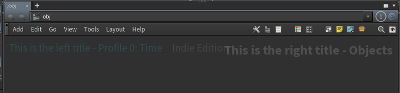
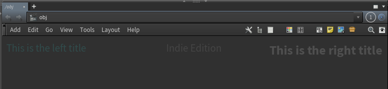
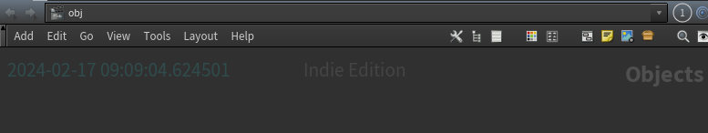

.. currentmodule:: houdini_core_tools.nodegraph

================
Node Graph Tools
================

The :mod:`~houdini_core_tools.nodegraph` module provides an object to manipulate Houdini nodegraph titles.

NodeGraphTitleManager
---------------------

The :class:`NodeGraphTitleManager` class is a singleton object that provides the
ability to manage titles on your scene's node graph.  It can be used to set the left or right title values to
static or dynamic values, as well as whether to include the default Houdini provided information in the output.

Currently Houdini supports setting the titles in the top **left** and **right** areas. You should use the
:class:`NodeGraphTitleLocation` enum to indicate which to set.

Static Titles
'''''''''''''

The most common titles you would set are static ones that don't need to dynamically update. A common use for this would
be to set the title to indicate a current pipeline context such as **Show / Seq / Shot** or a role.

To set static titles you just need to pass in the values you want to be displayed with the
:meth:`NodeGraphTitleManager.set_static_title` method.

.. code-block:: python

    >>> NodeGraphTitleManager().set_static_title(
    ...     NodeGraphTitleLocation.LEFT, "This is the left title"
    ... )
    >>> NodeGraphTitleManager().set_static_title(
    ...     NodeGraphTitleLocation.RIGHT, "This is the right title"
    ... )

Here we see that we've added out values into the titles and that we also maintain the default title information provided
by Houdini. In this case the **Performance Monitor** is enabled and providing additional information on the left, and
the current node context is displayed on the right.

We can choose not to include the default data if desired:

.. code-block:: python

    >>> NodeGraphTitleManager().set_static_title(
    ...     NodeGraphTitleLocation.LEFT, "This is the left title", include_default=False
    ... )
    >>> NodeGraphTitleManager().set_static_title(
    ...     NodeGraphTitleLocation.RIGHT, "This is the right title", include_default=False
    ... )

Dynamic Titles
--------------
It is also possible to set the titles to be dynamic and updated any time the network editor is redrawn. To do this you
need to pass a callable object which returns a string using the :meth:`NodeGraphTitleManager.set_dynamic_title` method

.. code-block:: python

    >>> import datetime
    >>> def title_graph_with_date():
    ...     return str(datetime.datetime.now())
    ...
    >>> NodeGraphTitleManager().set_dynamic_title(
    ...     NodeGraphTitleLocation.LEFT, title_graph_with_date
    ... )

Now, any time the network editor is updated the title will update to the time it occurs.

Resetting Titles
----------------
You can easily reset the titles to the default behavior via the :meth:`NodeGraphTitleManager.reset_title`.

.. code-block:: python

    >>> NodeGraphTitleManager().reset_title(NodeGraphTitleLocation.LEFT)
    >>> NodeGraphTitleManager().reset_title(NodeGraphTitleLocation.RIGHT)
