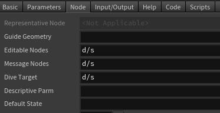

.. currentmodule:: houdini_core_tools.nodes

==========
Node Tools
==========

The :mod:`~houdini_core_tools.nodes` module provides tools related to dealing with a Houdini nodes.

disconnect_all_inputs
---------------------

The :func:`disconnect_all_inputs` function will disconnect all the node's inputs.

disconnect_all_outputs
----------------------

The :func:`disconnect_all_outputs` function will disconnect all the node's outputs.

get_containing_node
---------------------

The :func:`get_containing_node` function will return the nearest parent node which is of a different node
type category than the passed node.

.. code-block:: python

    # Skips the parent Subnet as it is a SOP node the contains SOPs.
    >>> houdini_core_tools.nodes.get_containing_node(hou.node("/obj/geo1/subnet1/file1"))
    <hou.ObjNode of type geo at /obj/geo1>
    >>> houdini_core_tools.nodes.get_containing_node(hou.node("/obj/geo1/subnet1"))
    <hou.ObjNode of type geo at /obj/geo1>
    >>> houdini_core_tools.nodes.get_containing_node(hou.node("/obj/geo1"))
    <hou.OpNode at /obj>
    >>> houdini_core_tools.nodes.get_containing_node(hou.node("/obj"))
    <hou.OpNode at />
    >>> houdini_core_tools.nodes.get_containing_node(hou.node("/"))
    None

get_node_author
---------------------

The :func:`get_node_author` function will return the user name of the node's creator.

This function used ``opls -d -l`` to extract the information

.. code-block:: python

    >>> houdini_core_tools.nodes.get_node_author(hou.node('/obj/geo1'))
    'graham'

.. code-block:: bash

    / -> opls -d -l /obj/geo1
    d---e-cs /obj/geo1                      Aug 23 09:24 graham [rwxrwxrwx]

get_node_descriptive_parameter
------------------------------

The :func:`get_node_descriptive_parameter` function will return the user name of the node's creator.

get_node_dive_target
--------------------

The :func:`get_node_dive_target` function will return the user name of the node's creator.

